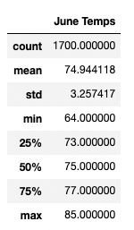
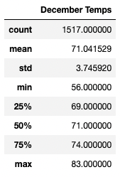

# Module 9: surfs_up

## 1. Overview of Analysis 

## 2. Results

### Deliverable 1 Dataframe: June Temperatures

Summary of June Temperatures:
  1. The average temperature is rounded to 75 degrees fahrenheit.
  2. The sample size is 1,700 temperatures recorded for june data set. 
  3. The Minimum temperature is 64 degrees fahrenheit. 

### Deliverable 2 Dataframe: December Temperatures

Summary of December Temperatures:
  1. The average temperature is rounded to 71 degrees fahrenheit.
  2. The sample size is 1,517 temperatures recorded for june data set. 
  3. The Minimum temperature is 56 degrees fahrenheit.

### Key Differences betweeen June and December Temperatures

Comparing June and December:
  1. 

## 3. Summary

