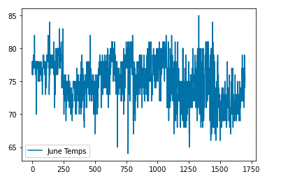
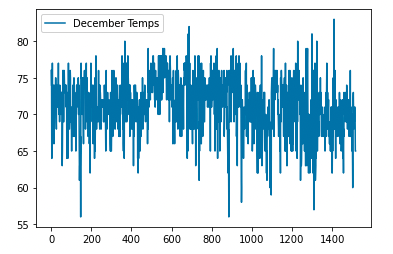

# Module 9: surfs_up

## 1. Overview of Analysis 

The purpose of the analysis is to help W. Avy identify temperature trends in the months of June and December on the island of Oahu in Hawaii. He wants to run a surf and ice cream shop and wants to make an informed business decision. 

Using the hawii.sqlite file, we will create a query to pull temperature data for the months of June and December.

## 2. Results

### Deliverable 1 Dataframe: June Temperatures

Summary of June Temperatures:
  1. The average temperature is rounded to 75 degrees fahrenheit.
  2. The sample size is 1,700 temperatures recorded for june data set.
  3. The Minimum temperature is 64 degrees fahrenheit. 
  4. The Maximum temperature is 85 degrees fahrenheit.

### Deliverable 2 Dataframe: December Temperatures

Summary of December Temperatures:
  1. The average temperature is rounded to 71 degrees fahrenheit.
  2. The sample size is 1,517 temperatures recorded for june data set. 
  3. The Minimum temperature is 56 degrees fahrenheit.
  4. The Maximum temperature is 83 degrees fahrenheit.

### Key Differences betweeen June and December Temperatures

Comparing June and December:
  1. The average temperature shows a small difference of 4 degrees (75 and 71) between June and December. 
  2. The Maximum temperature shows a small difference is 2 degrees (85 and 83) between June and December.
  3. The Minimum temperature shows a larger difference is 8 degrees (64 and 54) between June and December.
      - The 54 degree fahrenheit low in December could be too cold for surfing and ice cream!
  4. The Standard Deviation for June is 3.26 and for December is 3.75. So December temperatures have slightly more variablility, which is touch for business planning. 

## 3. Summary

Additional Queries for Analysis:

  1. I ran a .plot display for the June temperatures to further understand the data and it's patterns. 
  
  
  
  2. I ran a .plot display for the December temperatures to further understand the data and it's patterns. 
  
  
        
        june_lows = session.query(Measurement.date, Measurement.tobs).filter(extract('month',Measurement.date)==6)
        
        june_lows = [t.tobs for t in june_lows]

        june_close = []

        for low in june_temps:
          if low <= 70:
            june_close.append(low)

        len(june_close

